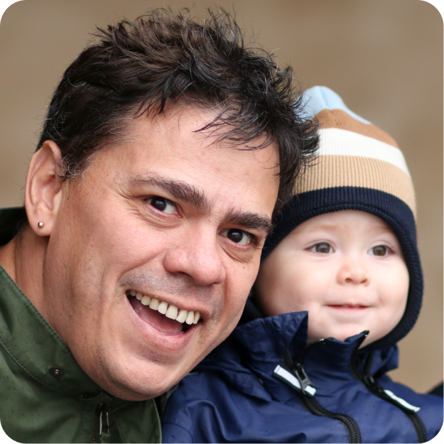

# Peter Strömberg

<table>
<tr>
<td valign="top"></td>
<td valign="top">
        
Hi! I am Peter, a dad (father of five), husband, developer contractor, open source contributor, and ceator of [Calva](https://calva.io/). My super powers are curiousity, creativity, and communication. To succeed I meet challenges wielding kindness, the [Clojure](https://clojure.org) REPL, and 40 years of developer experience. Things that give me energy are coding, collaboration, and speaking with users.

</td>        
</tr>
</table>

 

## Employment

[Agical](https://agical.se/) pays me a fulltime, competetive, salary & benefits to spend:
* 80% of my time as a Clojure consultant (currently 60%)
* 20% of my time on open source (currently 40%)

## Follow me
* Twitter: [@pappapez](https://twitter.com/pappapez)
* Blog: [A few words from PEZ](https://blog.agical.se/en/authors/peter-stromberg) ([rss](https://blog.agical.se/en/authors/peter-stromberg/index.xml))
* LinkedIn: [@cospaia](https://www.linkedin.com/in/cospaia/)